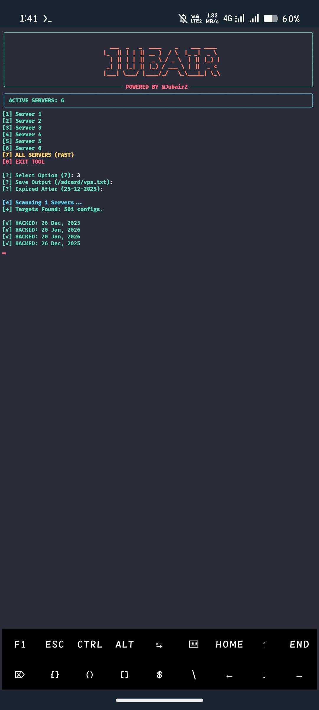
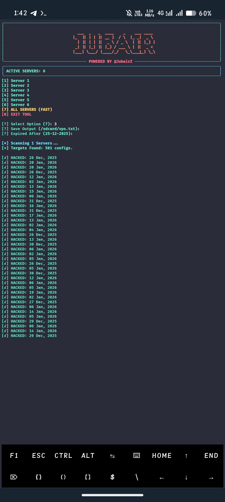

<h1 align="center">🚀 CRACK VPS – Termux Auto Client</h1>

<p align="center">
  <b>Powerd by @JubairZ</b><br>
  Telegram: <a href="https://t.me/JubairZ">https://t.me/JubairZ</a>
</p>

<hr>

<h2>📌 About This Project</h2>

<p>
This tool allows you to automatically import and run <b>SSH WS, VLESS, VMESS, TROJAN</b> servers  
directly on your <b>Android device using Termux</b>.
</p>

<p>
Servers are created from VPS and synced to mobile automatically.
</p>

<p>
If domain connection fails, you must use <b>server IP instead of domain</b>.
</p>

<hr>

<h2>⚙️ Requirements</h2>

<ul>
  <li>Android Device</li>
  <li>Termux (Latest)</li>
  <li>Internet Connection</li>
</ul>

<hr>

<h2>🛠️ Termux Setup Commands</h2>

<p>Run these commands step by step inside Termux:</p>

```bash
pkg update -y
pkg upgrade -y
pkg install python git -y
pip install requests bs4 rich

```

<hr>

<h2>📥 Clone Repository</h2>

```bash
git clone https://github.com/jubairbro/CRACK-VPS
cd CRACK-VPS
```

<hr>

<h2>▶️ Run Tool</h2>

```py
python run.py
```

<hr>

<h2>🖼️ Screenshots</h2>
<table align="center">
  <tr>
    <td>
      
    </td>
    <td>
      
    </td>
  </tr>
</table>
<hr>

<h2>🔐 Server Information</h2>

<ul>
  <li>XRAY All Servers Limited to <b>200 GB</b></li>
  <li>All Accounts are <b>Shared</b></li>
  <li>If not working, use <b>IP instead of Domain</b></li>
</ul>

<hr>

<h2>⚠️ Disclaimer</h2>

<p>
This project is for <b>educational purposes only</b>.  
The author is not responsible for misuse.
</p>

<hr>

<h2>🌍 Support</h2>

<p>
Join Telegram for updates & support:<br>
<a href="https://t.me/JubairSensei">https://t.me/JubairSensei</a>
</p>

<hr>

<h3 align="center">🇧🇩 #FreePalestine</h3>
