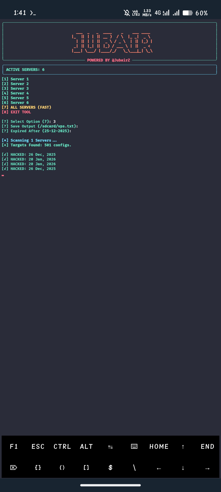
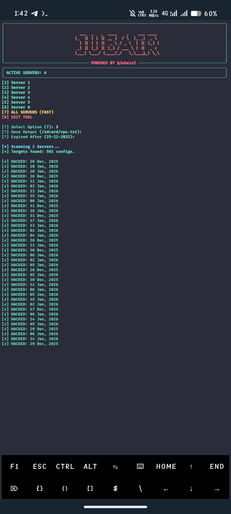

<h1 align="center">🚀 SENSEI VPS PREMIUM</h1>

<p align="center">
  <a href="https://t.me/JubairSensei"></a>
  
  
</p>

<p align="center">
  <b>Advanced Auto Client for SSH WS, VLESS, VMESS & TROJAN</b><br>
  <i>Powered by <a href="https://t.me/JubairSensei">@JubairSensei</a></i>
</p>

<hr>

<h2>📌 About This Project</h2>

This powerful tool allows you to automatically fetch, import, and execute **SSH WS, VLESS, VMESS, and TROJAN** configurations directly on your **Android device using Termux**. 

The configs are synced in real-time from our remote VPS database.

> **Note:** If the domain connection fails at any point, please use the **Server IP instead of the Domain**.

<hr>

<h2>✨ Key Features</h2>

* 🔥 **One-Click Installation:** No manual package installation or git cloning needed.
* ⚙️ **Smart Architecture Detection:** Automatically detects your device (32-bit `armv7` or 64-bit `aarch64`) and installs the compatible core engine.
* 🛡️ **Highly Secure Core:** Built with compiled `.so` (Cython) binaries for maximum performance and reverse-engineering protection.
* ⚡ **Global Execution:** Run the tool from anywhere in Termux by simply typing `vps`.

<hr>

<h2>⚙ Requirements</h2>

* Android Device (32-bit or 64-bit)
* Termux (Latest Version)
* Active Internet Connection

<hr>

<h2>🛠 Quick Installation (One-Liner)</h2>

Forget about long commands. Just copy and paste this single line into your Termux and hit enter:

```bash
bash <(curl -Ls [https://raw.githubusercontent.com/jubairbro/CRACK-VPS/main/setup.sh](https://raw.githubusercontent.com/jubairbro/CRACK-VPS/main/setup.sh))
```
*(This command will automatically update your system, install dependencies, configure the core engine, and set up the global launcher.)*

<hr>

<h2>▶ How to Run</h2>

Once the installation is complete, you don't need to navigate to any folder. Just type:

```bash
vps
```

<hr>

<h2>🖼 Screenshots</h2>
<table align="center">
  <tr>
    <td>
      
    </td>
    <td>
      
    </td>
  </tr>
</table>

<hr>

<h2>🔐 Server Information</h2>

* XRAY All Servers are Limited to **200 GB**.
* All Accounts provided are **Shared**.
* If a config stops working, try using the **IP instead of the Domain**.

<hr>

<h2>⚠ Disclaimer</h2>

This project is made strictly for **educational and research purposes only**. The author (@JubairSensei) is not responsible for any misuse, damage, or illegal activities performed using this tool. Use it at your own risk.

<hr>

<h2>🌍 Support & Updates</h2>

Join our official Telegram channel for tool updates, premium configs, and support:<br>
👉 **[t.me/JubairSensei](https://t.me/JubairSensei)**

<hr>

<h3 align="center">🇧🇩 #FreePalestine 🇵🇸</h3>
